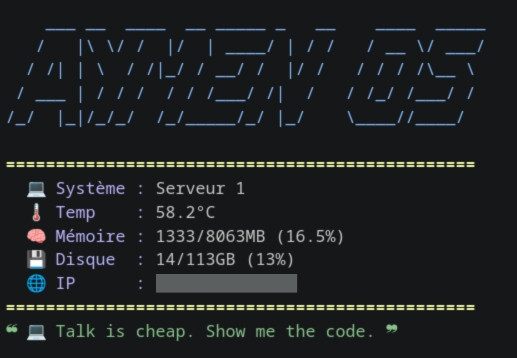

# 🖥️ AymenOS MOTD - Serveur

Script de bienvenue personnalisé pour SSH (Utilisé pour mon serveur). 
Affiche un dashboard système style "Cyberpunk/Hacker" avec monitoring et citations tech.

## 📸 Aperçu
- Logo ASCII Art **AYMEN OS**
- Température CPU / RAM / Disque / IP
- Citation aléatoire


## 🚀 Installation rapide (One-line command)

Copiez-collez cette commande dans votre terminal Raspberry Pi :

```bash
sudo curl -o /etc/profile.d/motd.sh https://raw.githubusercontent.com/iamtheamn/Serveur-MOTD/main/motd.sh && sudo chmod +x /etc/profile.d/motd.sh && touch ~/.hushlogin && echo "Installation terminée ! Reconnectez-vous."
```

## 🛠️ Désinstallation
Simplement supprimer le fichier :
```Bash
sudo rm /etc/profile.d/motd.sh
```
